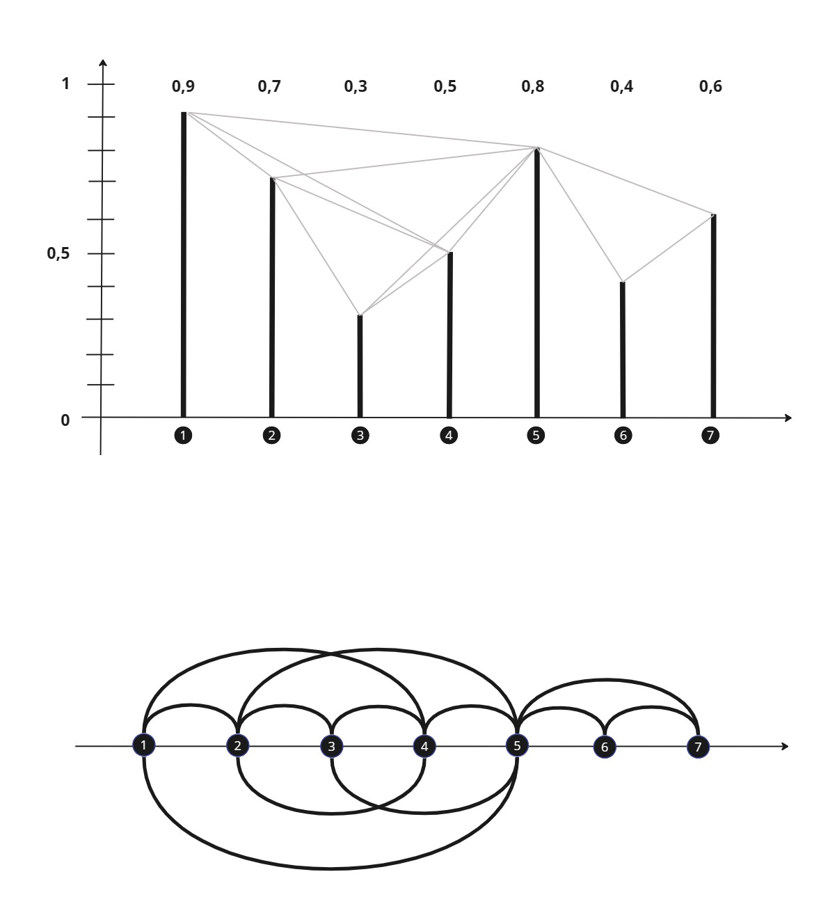
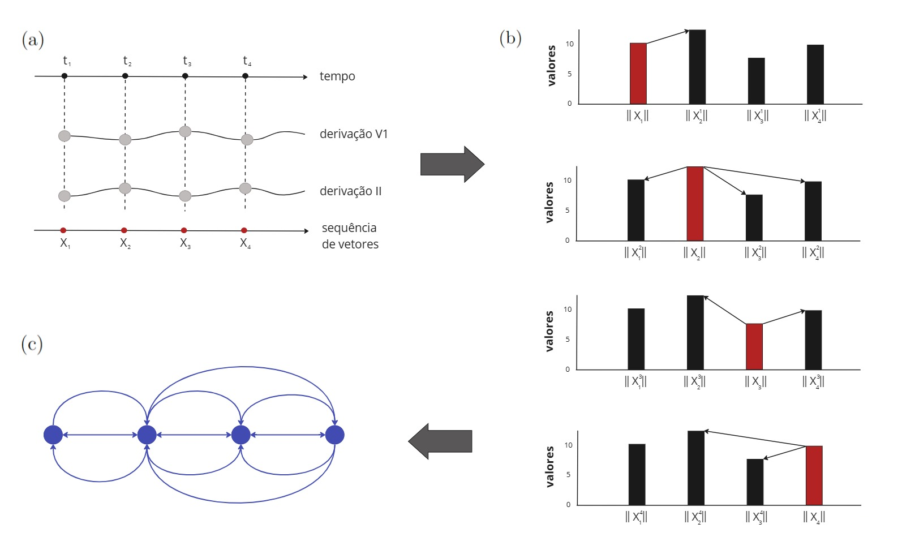

# Visibility Graph e Vector Visibility Graph

Este repositório apresenta a implementação de dois métodos de conversão de sinais de ECG em grafos para classificação de arritmias utilizando redes convolucionais de grafos ([GCN](https://tkipf.github.io/graph-convolutional-networks/)). Este foi o tema do meu mestrado em Ciência da Computação pela Universidade Federal de Ouro Preto. As bibliotecas [DGL](https://www.dgl.ai/) e [PyTorch](https://pytorch.org/) são utilizadas na implementação das redes convolucionais de grafos. O conjunto de dados utilizado é o [The Massachusetts Institute of Technology - Beth Israel Hospital Arrhythmia Database](https://physionet.org/content/mitdb/1.0.0/).

+ Visibility Graph (VG)

Método proposto por Lacasa _et al._ no artigo intitulado [_From times series to complex networks: The visibility graph_](https://www.pnas.org/doi/abs/10.1073/pnas.0709247105). Este método realiza a conversão de uma série temporal (sinal de ECG) unidimensional em uma rede complexa. Na implementação para o uso de redes convolucionais de grafos, utilizou-se o pacote [ts2vg](https://pypi.org/project/ts2vg/) que implementa o método _visibility graph_.

+ Vector Visibility Graph (VVG):

Método proposto por Ren e Jin no artigo intitulado [Vector visibility graph from multivariate time series: a new method for characterizing nonlinear dynamic behavior in two-phase flow](https://link.springer.com/article/10.1007/s11071-019-05147-7). Este método é baseado no método VG, mas aplicado na conversão de séries temporais multivariadas em rede complexa. Por não apresentar implementação disponibilizada via pacote python, utilizou-se implementação própria com auxílio das bibliotecas numpy e networkX. O tempo médio de conversão dos sinais de ECG com 280 amostras é de aproximadamente 0,2s.

+ Bibliotecas necessárias
  +  dgl==1.0.1
  +  igraph==0.10.1
  +  matplotlib==3.5.2
  +  numpy==1.22.4
  +  networkx==3.1
  +  pandas==1.4.2
  +  scipy==1.8.1
  +  scikit-learn==1.1.1
  +  seaborn==0.11.2
  +  torch==2.0.0
  +  ts2vg==1.2.2  
